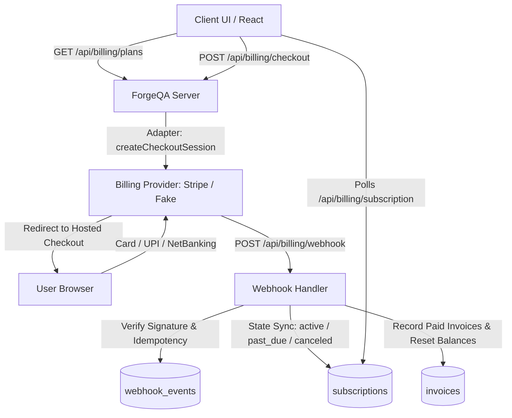

# ForgeQA Billing & Subscriptions Architecture

This document describes the billing architecture, payment adapter layer, webhook state machine, entitlements, and usage metering for ForgeQA.

---

## 1. Architecture Overview



---

## 2. Core Principles

1. **Never touch raw card data**: All payment transactions occur via hosted checkout sessions or provider portals. The ForgeQA application never receives, logs, or stores card numbers, CVVs, or full PANs.
2. **The webhook is the source of truth**: Subscriptions are never marked active based on browser redirects alone. Verified webhooks trigger subscription state transitions.
3. **Money as integers**: All amounts are stored in the smallest currency unit (`paise` for `INR`, `cents` for `USD`). No floating-point math for money.
4. **Idempotency everywhere**: Webhook handling uses `webhook_events` deduplication; usage metering uses atomic updates and unique `idempotency_key` logs.
5. **Secrets in env only**: API keys and secrets reside only in environment variables.

---

## 3. Data Model (MongoDB)

| Collection       | Key Fields                                                                                                                                              | Purpose                                      |
| ---------------- | ------------------------------------------------------------------------------------------------------------------------------------------------------- | -------------------------------------------- |
| `plans`          | `id`, `code`, `name`, `interval`, `price_amount`, `currency`, `provider_price_id`, `is_active`, `limits`                                                | Public catalog of sellable plans             |
| `customers`      | `id`, `owner_id`, `provider`, `provider_customer_id`, `email`, `created_at`                                                                             | Maps billing owner to provider customer      |
| `subscriptions`  | `id`, `owner_id`, `plan_code`, `status`, `provider_subscription_id`, `current_period_start`, `current_period_end`, `cancel_at_period_end`, `updated_at` | Tracks active subscription status            |
| `invoices`       | `id`, `owner_id`, `provider_invoice_id`, `amount_due`, `amount_paid`, `currency`, `status`, `hosted_invoice_url`, `pdf_url`, `created_at`               | Mirror of provider invoices for reporting    |
| `usage_events`   | `id`, `owner_id`, `metric`, `quantity`, `idempotency_key`, `created_at`                                                                                 | Append-only audit log for metered events     |
| `usage_balances` | `owner_id`, `metric`, `period_start`, `used`, `limit`                                                                                                   | Fast O(1) balance counters per billing cycle |
| `webhook_events` | `provider`, `event_id`, `type`, `payload`, `processed_at`, `error`                                                                                      | Deduplication store and audit trail          |

---

## 4. Provider Adapter Layer

All application code interacts with the abstract `BillingProvider` interface:

```javascript
import { getBillingProvider } from './server/billing/providers/index.js';

const provider = getBillingProvider();
const session = await provider.createCheckoutSession(owner, plan, successUrl, cancelUrl);
```

- **`FakeProvider`**: Zero-network local dev & test provider. Auto-activates in local environments without requiring Stripe keys.
- **`StripeProvider`**: Production Stripe adapter using official `stripe` SDK with checkout sessions and customer portal.

---

## 5. API Endpoints

All endpoints (except public catalog and webhook) authenticate via JWT and resolve `owner_id` from the authenticated user token.

| Endpoint                    | Method | Auth      | Description                                      |
| --------------------------- | ------ | --------- | ------------------------------------------------ |
| `/api/billing/plans`        | `GET`  | No        | Public catalog of active plans                   |
| `/api/billing/webhook`      | `POST` | Signature | Provider webhook handler                         |
| `/api/billing/subscription` | `GET`  | Yes       | Current plan, status, renewal date, cancel state |
| `/api/billing/usage`        | `GET`  | Yes       | Current period usage vs limits                   |
| `/api/billing/checkout`     | `POST` | Yes       | Creates checkout session URL                     |
| `/api/billing/portal`       | `POST` | Yes       | Customer self-serve billing portal               |
| `/api/billing/change-plan`  | `POST` | Yes       | Upgrade or downgrade plan                        |
| `/api/billing/cancel`       | `POST` | Yes       | Cancel subscription at period end                |
| `/api/billing/resume`       | `POST` | Yes       | Resume cancellation                              |
| `/api/billing/invoices`     | `GET`  | Yes       | Paginated invoice history                        |

---

## 6. Entitlements & Metering Engine

Import from `server/billing/entitlements.js`:

```javascript
import { can, remaining, consume } from './server/billing/entitlements.js';

// 1. Boolean feature check
const hasAutomationSuites = await can(ownerId, 'automationFrameworks');

// 2. Check remaining quota
const left = await remaining(ownerId, 'ai_runs');

// 3. Atomically consume quota with idempotency key
const { ok, remaining } = await consume(ownerId, 'ai_runs', 1, runId);
if (!ok) {
  throw new Error('AI run limit exceeded for this period');
}
```

### Grace Period Handling

When a subscription payment fails (`past_due`), users retain access for `BILLING_GRACE_PERIOD_DAYS` (default 7 days). After the grace period expires, access falls back to the Free Starter limits.

---

## 7. Local Webhook Forwarding with Stripe CLI

To test Stripe webhooks locally:

```bash
# 1. Install Stripe CLI and login
stripe login

# 2. Forward events to local ForgeQA server
stripe listen --forward-to localhost:3000/api/billing/webhook

# 3. Copy the webhook signing secret output by the CLI into .env
STRIPE_WEBHOOK_SECRET=whsec_...
```

---

## 8. How-To Guides

### How to Add a New Plan

Edit `SEED_PLANS` in `server/billing/schema.js`:

```javascript
{
  id: 'plan_team_annual',
  code: 'team',
  name: 'ForgeQA Team Annual',
  interval: 'year',
  price_amount: 4999000, // 49,990.00 INR (paise)
  currency: 'INR',
  provider_price_id: 'price_stripe_id',
  is_active: true,
  limits: {
    ai_runs_per_month: 10000,
    test_cases: 25000,
    knowledge_docs: 50,
    seats: 25
  },
  flags: {
    automationFrameworks: true,
    regressionSuites: true,
    cicdWebhooks: true
  }
}
```

### How to Add a New Metered Metric

1. Add the metric key to the plan `limits` object (e.g. `api_calls: 50000`).
2. At the callsite in the application, invoke:

```javascript
const { ok } = await consume(ownerId, 'api_calls', 1, requestId);
if (!ok) {
  return res.status(429).json({ error: 'API calls limit reached' });
}
```

---

## 9. Security & Compliance Checklist

- [x] No raw card data touches ForgeQA servers or application logs
- [x] Webhook signatures verified before payload parsing
- [x] All billing endpoints authorize against server-resolved billing owner
- [x] Money stored in integer units (paise/cents)
- [x] Out-of-order and duplicate webhook events safely handled
- [x] Audit trail maintained in `webhook_events` and `usage_events`
