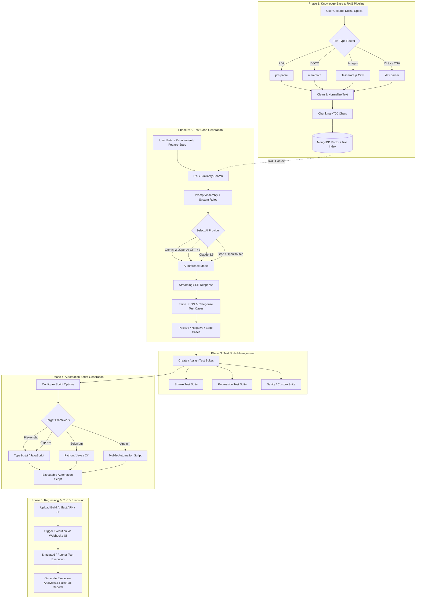

# ForgeQA - Complete End-to-End Process Flow

Below is the complete end-to-end process flow for the **ForgeQA** AI-powered QA automation platform, presented both as a high-resolution visual infographic image and a detailed technical diagram.

---

## 🎨 Visual Process Flow Infographic

---

## 🔄 Detailed Process Flow Diagram (Mermaid)

---

## 📋 Phase Breakdown Summary

| Phase | Core Action | Key Outputs & Technologies |
| :--- | :--- | :--- |
| **1. Knowledge Ingestion (RAG)** | Upload requirements, PRDs, specs, design images | Vector index, text chunks in MongoDB, extracted OCR text |
| **2. AI Test Generation** | Stream requirement text + RAG context through LLMs | Categorized structured test cases (Positive, Negative, Edge) |
| **3. Test Suite Management** | Organize generated test cases into logical groups | Color-coded Smoke, Sanity, & Regression Test Suites |
| **4. Script Generation** | Convert test cases into framework-specific code | Executable Playwright, Cypress, Selenium, or Appium code |
| **5. CI/CD & Execution** | Run automated regression suites on build artifacts | Test execution pass/fail logs, status metrics, analytics dashboard |
